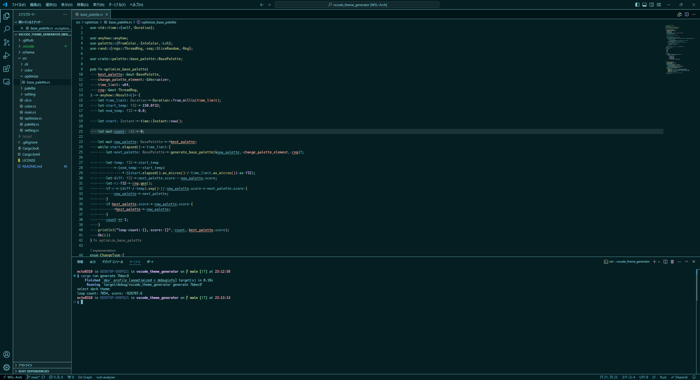
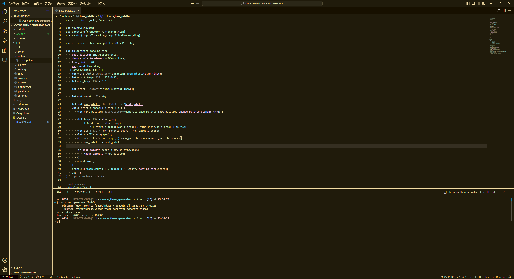
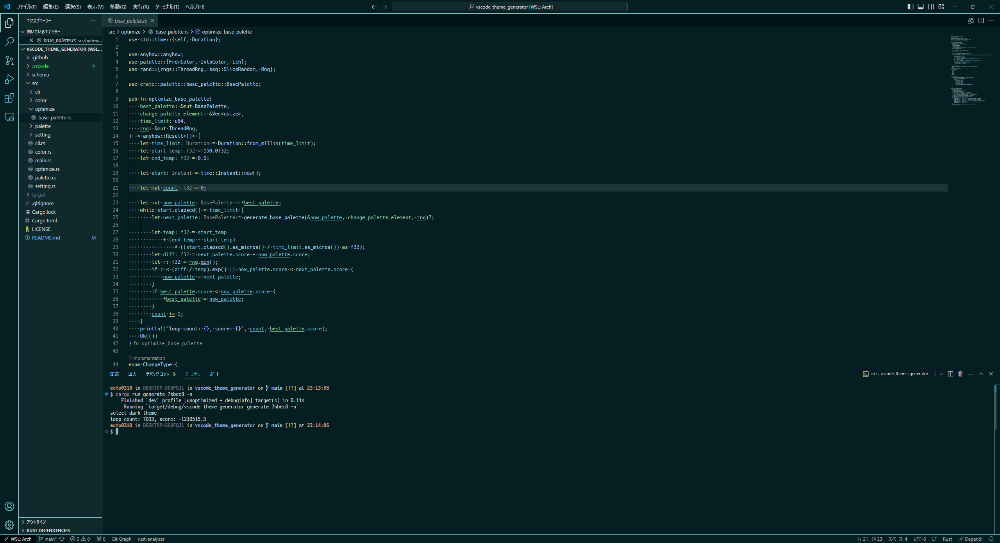
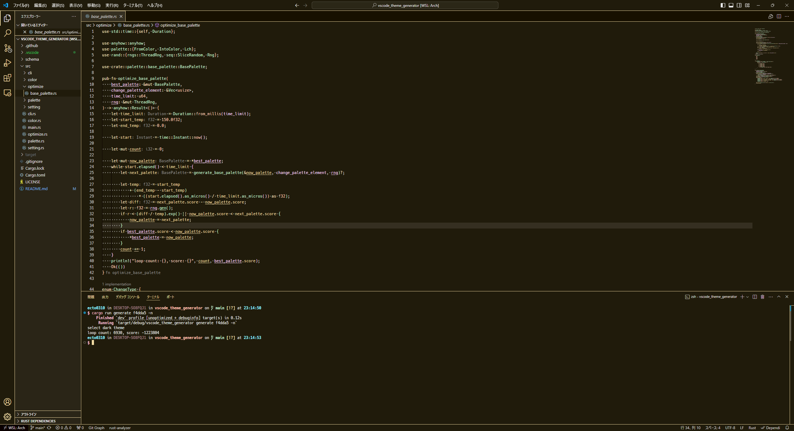

# VSCode Theme Generator

This is a tool to assist in the creation of VSCode themes.
Just specify one color and the theme is automatically created.

## DEMO

|#7bbec8|#f4dda5|
|---|---|
|||
|||

# Usage

```bash
git clone https://github.com/ecto0310/vscode_theme_generator
# Settings are output to .vscode under the current directory
# The .vscode must be placed in the root of the workspace in VScode for the settings to take effect
cargo run --release generate 7bbec8

# Target name is palette.json's key name
# Anually modify palette.json and run without the -f option
cargo run --release regenerate -f blue -f green
```
